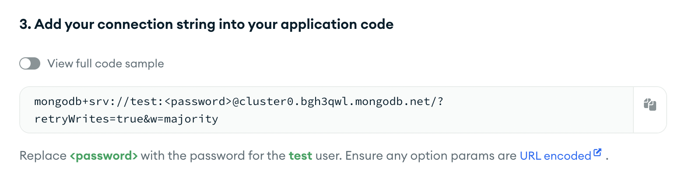
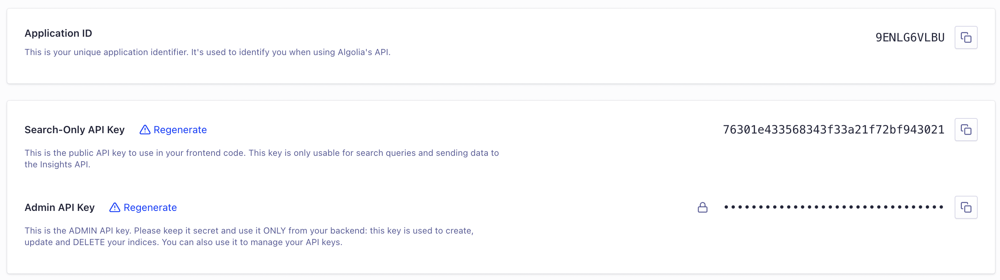

# cs35l_project

# General Prerequisites

We use Node.js v.16.15.1 and npm v.8.11.0, which you can install from the [Node.js releases](https://nodejs.org/en/about/previous-releases). There are no version specific functionality used, so realistically any Node.js newer version should not be breaking, however, this was not throughouly tested. 

## Database and Services Setup

In the prerequisite, we need to setup two different services, MongoDB and Algolia. MongoDB is a noSQL database, which we use to store the meta information regarding the tests and the users, and the PDF document itself is stored locally. The Aloglia service is a used as a search engine, which we use for the content discovery feature. We will walk through the setup, but please contact us if you want the API keys and environment variables.

### MongoDB Atlas Setup

Any [MongoDB instance works](https://www.mongodb.com/), but we prefer to utilize an [Atlas environment](https://www.mongodb.com/cloud/atlas/register) due to easy setup. Here's how we setup. Again, please contact us and we can provide you directly with the .env key and to skip this process. 

1. We register an account with MongoDB [Atlas](https://www.mongodb.com/cloud/atlas/register). 
2. It will ask you a series of questions, it really isn't important what you answer here. 
3. Click 'Create a Deployment'. Any cluster works, but we select an M0 as it is free. 

4. Next, we fill the security quickstart. 
    1. We enter an admin username and password. 
    2. We select the option of connecting from 'My Local Environment'. 
    3. (Optional) We added the IP Address of 0.0.0.0, for development purposes, which allowed users to connect from anywhere.

5. Then, we click the connect button on our cluster (we named it 'Cluster0'), and the 'Driver' option. 
6. Underneath Step 3. of this popup, we copy the connection string and replace the password with the password we entered for the admin account. 

7. Save this connection string for the MONGODB_ACCESS environment variable in the .env file in the server folder that we will discuss later. 

### Algolia Setup

1. We register an account with [Algolia](https://dashboard.algolia.com/signup/personal_information). It will prompt you with a series of questions, it's not really important what you answer. 
2. Click the 'API Keys' tab in the Welcome section of the dashboard. 

3. Copy and save the Application ID (as we will use it as the ANGOLIA_APPLICATION_ID in the .env file for the folder) and the Admin API Key
(as we will use it as the ANGOLIA_API_KEY in the .env file). 


## Client Setup

Run the following bash commands:
```bash
$ cd ./client
$ npm install
$ npm start
```

## Server Setup

### GraphicsMagick Setup

One of the packages we use for OCR (called tesseract.js) requires us to install a native package called [GraphicsMagick](http://www.graphicsmagick.org/INSTALL-unix.html). The exact way to install this package is dependent on the platform that you run this application on. For MacOS/UNIX systems, it is possible to install from building (as shown in the [package instructions](http://www.graphicsmagick.org/INSTALL-unix.html)), or as we recommend, installing from a [package manager called 'homebrew'](https://formulae.brew.sh/formula/graphicsmagick). For Windows systems, we recommend installing from a [Installer Package from the source directly](http://www.graphicsmagick.org/INSTALL-windows.html). 

### Setting up the .env file

If you look within the 'server' folder, will see a .env.example file. Make a copy of this file, and call it '.env'. Replace the associated values pf MONGODB_ACCESS, ANGOLIA_API_KEY, ANGOLIA_APPLICATION_ID with the values and API keys above. You can replace the 'SESSION_SECRET' with anything you want, it is just the key used to encrypt coookies on the backend. The 'ANGOLIA_INDEX_NAME' can be replaced with anything, it is the 'index' or database name that will be created or used on the Algolia service. Again, please contact us if you want to skip this process of setting up, and we can send you the .env file.  

### Install packages on the server side

Run the following code:
```bash
$ cd ./server
$ npm install
$ npm start
```

